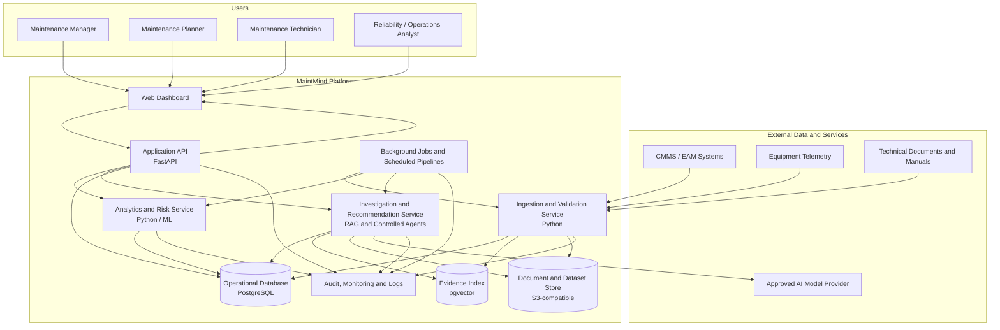

# MaintMind Container Diagram

## Purpose

This diagram shows the main deployable containers inside MaintMind, the users
and external systems that interact with them, and the primary data flows between
the platform components.

## Container Diagram

## Container Responsibilities

- **Web Dashboard:** Presents asset risk, recurring failures, evidence, reports,
  and human-review workflows.
- **Application API:** Provides authenticated access to platform capabilities
  and coordinates requests between the interface and internal services.
- **Ingestion and Validation Service:** Imports source data, validates schemas,
  records provenance, and transforms records into the canonical model.
- **Analytics and Risk Service:** Produces deterministic metrics, recurring
  failure analysis, equipment-risk rankings, and predictive outputs.
- **Investigation and Recommendation Service:** Retrieves supporting evidence
  and creates traceable recommendations subject to human approval.
- **Background Jobs and Scheduled Pipelines:** Runs recurring ingestion,
  validation, analytics, indexing, and monitoring tasks.
- **Data Stores:** Separate operational records, vector evidence, and source
  documents while preserving provenance and audit history.

## Architectural Boundaries

MaintMind does not directly control equipment or automatically approve or
execute maintenance actions. High-impact recommendations must remain
evidence-linked, auditable, and subject to authorised human review.
