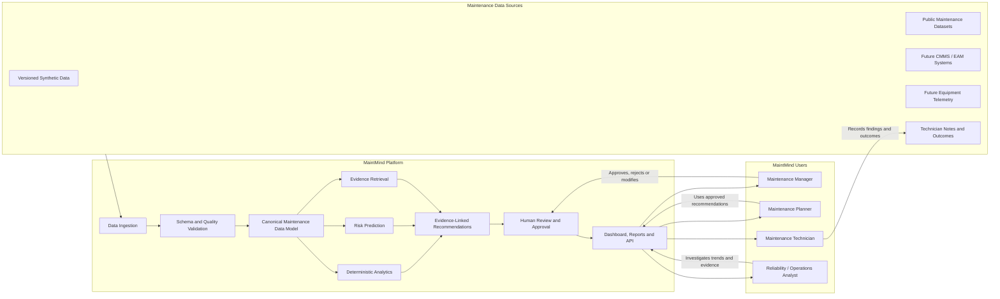

# MaintMind Product Context

## Purpose

MaintMind is an AI-assisted maintenance intelligence platform that transforms
maintenance records, equipment history, technician notes, and operational data
into traceable risk insights and human-reviewed maintenance recommendations.

## Product Context Diagram

## System Boundary

MaintMind supports analysis and recommendations, but it does not directly
control machinery, automatically execute maintenance work, or replace human
maintenance professionals.

All important recommendations require supporting evidence and human review.
